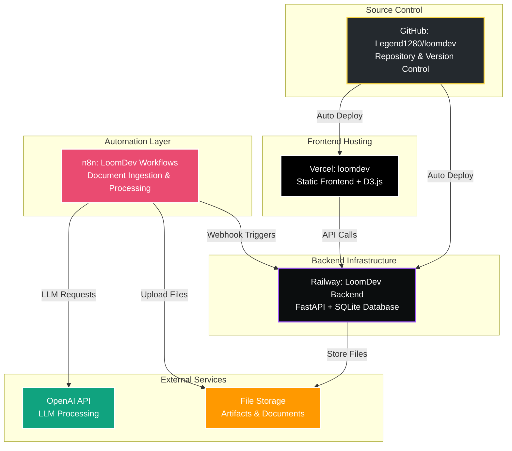
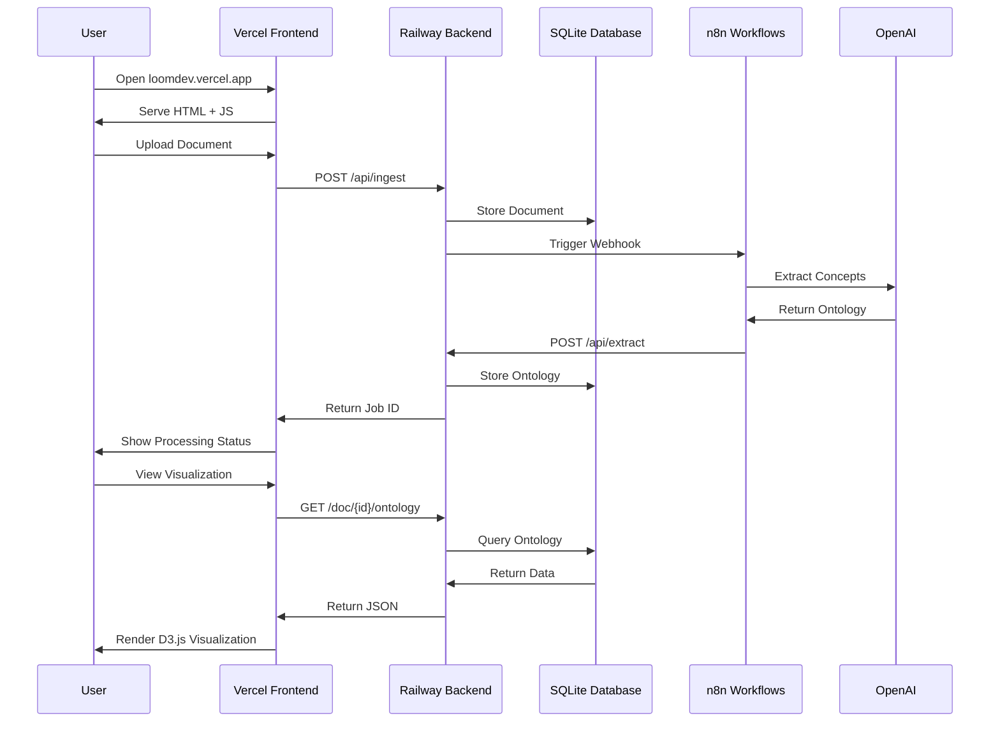
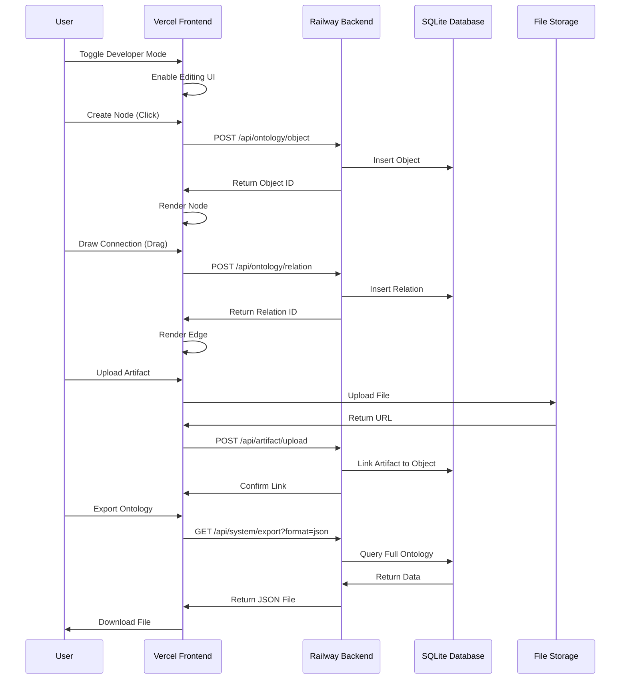
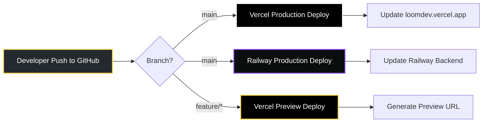

# LoomDev v0.1 - Deployment Architecture

**Date**: October 26, 2025  
**Status**: ✅ Full Stack Deployed

This document describes the complete deployment architecture for LoomDev across GitHub, Railway, n8n, and Vercel.

---

## Architecture Overview

LoomDev is deployed as a distributed system across four platforms, each handling a specific aspect of the application:



---

## Platform Breakdown

### 1. GitHub: Source Control

**Repository**: https://github.com/Legend1280/loomdev  
**Purpose**: Version control, code collaboration, CI/CD trigger

**What's Stored:**
- Frontend JavaScript modules (16 files)
- Backend Python modules (24 files)
- Configuration files (vercel.json, railway.json)
- Documentation (README, guides, standards)
- Database schema and migrations

**Key Features:**
- Main branch for production code
- Feature branches for development
- Automatic deployment triggers to Vercel and Railway
- Issue tracking and project management

**Relationship to LoomLite:**
- Duplicated from `Legend1280/loomlite`
- Independent repository with separate history
- Can evolve independently while preserving LoomLite stability

---

### 2. Railway: Backend Infrastructure

**Project**: LoomDev Backend  
**URL**: `https://loomdev-backend.up.railway.app` (example)  
**Purpose**: FastAPI server, database, API endpoints

**What's Deployed:**
- FastAPI application (`backend/main.py`)
- SQLite database with FTS5 full-text search
- Document processing and extraction logic
- Ontology management APIs
- File upload and storage handlers

**Key Endpoints:**
- `GET /tree` - Document tree structure
- `GET /doc/{id}/ontology` - Document ontology
- `POST /api/ingest` - Document ingestion
- `POST /api/ontology/object` - Create ontology object (v0.1)
- `POST /api/artifact/upload` - Upload artifact (v0.1)
- `GET /api/system/export` - Export ontology (v0.1)

**Environment Variables:**
- `DATABASE_URL` - SQLite database path
- `OPENAI_API_KEY` - For LLM processing
- `S3_BUCKET` - File storage bucket
- `S3_ACCESS_KEY` - AWS credentials
- `S3_SECRET_KEY` - AWS credentials

**Deployment:**
- Auto-deploy from GitHub main branch
- Railway CLI for manual deployments
- Environment variables replicated from LoomLite

**Relationship to LoomLite:**
- Cloned Railway project
- Independent database instance
- Separate backend endpoint
- Same codebase, different deployment

---

### 3. n8n: Automation Layer

**Workspace**: LoomDev Workflows  
**Purpose**: Document ingestion automation, LLM processing, webhook handling

**Workflows:**

#### Workflow 1: Document Ingestion Pipeline
```
Webhook Trigger
    ↓
File Upload Node
    ↓
HTTP Request → Railway Backend (/api/ingest)
    ↓
Wait Node (5 seconds)
    ↓
HTTP Request → Railway Backend (/api/job/{id})
    ↓
IF Node (Check status == "completed")
    ↓
HTTP Request → Railway Backend (/doc/{id}/ontology)
    ↓
Slack/Email Notification
```

#### Workflow 2: LLM Extraction Pipeline
```
Webhook Trigger
    ↓
Read File Node
    ↓
OpenAI Node (Extract concepts)
    ↓
HTTP Request → Railway Backend (/api/extract)
    ↓
Store Results
```

#### Workflow 3: Artifact Processing
```
File Upload Trigger
    ↓
Upload to S3
    ↓
HTTP Request → Railway Backend (/api/artifact/upload)
    ↓
Link to Ontology Object
```

**Integrations:**
- Railway API (backend communication)
- OpenAI API (LLM processing)
- AWS S3 (file storage)
- Slack/Email (notifications)

**Environment Variables:**
- `RAILWAY_API_URL` - Backend endpoint
- `OPENAI_API_KEY` - LLM processing
- `S3_BUCKET` - File storage
- `SLACK_WEBHOOK` - Notifications

**Relationship to LoomLite:**
- Duplicated workflows from LoomLite workspace
- Updated endpoints to point to LoomDev Railway backend
- Same automation logic, different target

---

### 4. Vercel: Frontend Hosting

**Project**: loomdev  
**URL**: https://loomdev.vercel.app  
**Purpose**: Static frontend hosting, CDN, automatic deployments

**What's Deployed:**
- Frontend HTML (`frontend/index.html`)
- JavaScript modules (eventBus, galaxyView, etc.)
- CSS styles (embedded in index.html)
- Static assets (favicon, logo, etc.)

**Configuration** (`vercel.json`):
```json
{
  "outputDirectory": "frontend",
  "headers": [
    {
      "source": "/(.*)\\.js",
      "headers": [
        { "key": "Content-Type", "value": "application/javascript; charset=utf-8" },
        { "key": "X-Content-Type-Options", "value": "nosniff" }
      ]
    }
  ]
}
```

**Environment Variables:**
- `VITE_API_URL` - Railway backend endpoint
- `VITE_APP_NAME` - "LoomDev"
- `VITE_VERSION` - "0.1.0"

**Deployment:**
- Auto-deploy from GitHub main branch
- Preview deployments for pull requests
- Production deployment on merge to main
- CDN distribution for global performance

**Relationship to LoomLite:**
- Imported from new GitHub repository
- Independent Vercel project
- Same frontend code, different deployment
- Environment variables preserved

---

## Data Flow

### User Interaction Flow



### Developer Mode Flow (v0.1)



---

## Environment Variables

### Shared Across All Platforms

These environment variables are consistent across Railway, n8n, and Vercel:

| Variable | Purpose | Used By |
|----------|---------|---------|
| `OPENAI_API_KEY` | LLM processing | Railway, n8n |
| `S3_BUCKET` | File storage bucket name | Railway, n8n |
| `S3_ACCESS_KEY` | AWS S3 credentials | Railway, n8n |
| `S3_SECRET_KEY` | AWS S3 credentials | Railway, n8n |
| `DATABASE_URL` | SQLite database path | Railway |
| `RAILWAY_API_URL` | Backend endpoint | Vercel, n8n |
| `SLACK_WEBHOOK` | Notification endpoint | n8n |

### Platform-Specific

**Railway Only:**
- `PORT` - Server port (auto-assigned)
- `RAILWAY_ENVIRONMENT` - Deployment environment

**Vercel Only:**
- `VITE_API_URL` - Backend API endpoint
- `VITE_APP_NAME` - Application name
- `VITE_VERSION` - Application version

**n8n Only:**
- `N8N_WEBHOOK_URL` - Webhook base URL
- `N8N_ENCRYPTION_KEY` - Credential encryption

---

## Deployment Workflow

### Continuous Deployment Pipeline



### Manual Deployment Steps

**1. Update Code in GitHub:**
```bash
git add .
git commit -m "Add feature"
git push origin main
```

**2. Automatic Deployments:**
- Vercel detects push and deploys frontend
- Railway detects push and deploys backend
- No manual intervention required

**3. Update n8n Workflows:**
- Log into n8n workspace
- Update workflow nodes if needed
- Save and activate workflows

**4. Verify Deployment:**
- Check Vercel deployment logs
- Check Railway deployment logs
- Test frontend at loomdev.vercel.app
- Test backend API endpoints
- Test n8n workflow triggers

---

## Monitoring and Maintenance

### Health Checks

**Frontend (Vercel):**
- URL: https://loomdev.vercel.app
- Status: Check page loads and renders
- Logs: Vercel dashboard → Project → Logs

**Backend (Railway):**
- URL: https://loomdev-backend.up.railway.app/system/status
- Status: Should return `{"status": "ok"}`
- Logs: Railway dashboard → Project → Logs

**n8n Workflows:**
- URL: n8n dashboard
- Status: Check workflow execution history
- Logs: n8n dashboard → Executions

### Debugging

**Frontend Issues:**
1. Check browser console for JavaScript errors
2. Check Vercel deployment logs
3. Verify API endpoint configuration
4. Test API calls with curl or Postman

**Backend Issues:**
1. Check Railway logs for Python errors
2. Verify database connectivity
3. Test API endpoints directly
4. Check environment variables

**n8n Issues:**
1. Check workflow execution logs
2. Verify webhook endpoints
3. Test OpenAI API connectivity
4. Check Railway backend availability

---

## Backup and Recovery

### GitHub
- **Backup**: Automatic (GitHub stores all history)
- **Recovery**: Clone repository, checkout specific commit

### Railway
- **Backup**: Database snapshots (manual or scheduled)
- **Recovery**: Restore from snapshot, redeploy

### n8n
- **Backup**: Export workflows as JSON
- **Recovery**: Import workflows from JSON

### Vercel
- **Backup**: Automatic (deployment history)
- **Recovery**: Rollback to previous deployment

---

## Security Considerations

### API Keys and Secrets
- All API keys stored as environment variables
- Never committed to GitHub
- Rotated regularly
- Access restricted to necessary services

### Database
- SQLite file stored on Railway persistent volume
- Regular backups to S3
- Access restricted to backend only

### Frontend
- No sensitive data in client-side code
- API calls authenticated via backend
- CORS configured for loomdev.vercel.app only

### n8n
- Credentials encrypted at rest
- Webhook URLs use authentication tokens
- Access restricted to authorized users

---

## Scaling Considerations

### Current Architecture (v0.1)
- **Frontend**: Static files on Vercel CDN (global distribution)
- **Backend**: Single Railway instance (vertical scaling)
- **Database**: SQLite (single file, limited concurrency)
- **n8n**: Single instance (sequential workflow execution)

### Future Scaling (v0.2+)
- **Frontend**: No changes needed (CDN scales automatically)
- **Backend**: Migrate to PostgreSQL for better concurrency
- **Database**: Horizontal scaling with read replicas
- **n8n**: Queue-based processing for parallel execution

---

## Cost Breakdown

### Estimated Monthly Costs

| Platform | Tier | Cost | Notes |
|----------|------|------|-------|
| GitHub | Free | $0 | Public repository |
| Railway | Hobby | $5 | 500 hours/month |
| n8n | Cloud Starter | $20 | 2,500 executions/month |
| Vercel | Hobby | $0 | 100 GB bandwidth |
| OpenAI | Pay-as-you-go | ~$10-50 | Depends on usage |
| AWS S3 | Free Tier | $0-5 | 5 GB storage |
| **Total** | | **$35-80/month** | |

### Cost Optimization
- Use Railway sleep mode for non-production environments
- Batch n8n workflow executions
- Implement caching to reduce OpenAI API calls
- Use S3 lifecycle policies to archive old files

---

## Relationship to LoomLite

### What Was Duplicated

| Component | LoomLite | LoomDev | Status |
|-----------|----------|---------|--------|
| GitHub Repo | `Legend1280/loomlite` | `Legend1280/loomdev` | ✅ Duplicated |
| Railway Backend | LoomLite Backend | LoomDev Backend | ✅ Cloned |
| n8n Workflows | LoomLite Workspace | LoomDev Workspace | ✅ Duplicated |
| Vercel Frontend | loomlite | loomdev | ✅ Imported |
| Database | LoomLite DB | LoomDev DB | ✅ Independent |
| Environment Vars | Shared | Replicated | ✅ Preserved |

### Independence

**LoomDev is now fully independent:**
- Separate codebase (can evolve independently)
- Separate backend (different database, different endpoint)
- Separate frontend (different URL, different deployment)
- Separate workflows (different triggers, different targets)

**LoomLite remains stable:**
- Original repository unchanged
- Original backend unchanged
- Original workflows unchanged
- Original frontend unchanged

### Evolution Strategy

**LoomLite (Stable):**
- Document visualization
- Read-only ontology viewing
- Production-ready features
- Bug fixes and maintenance

**LoomDev (Experimental):**
- Developer Mode toggle
- Editable visualizations
- Ontology authoring
- New features and experiments

---

## Next Steps

### Immediate (Week 1)
1. ✅ Verify all deployments are working
2. ✅ Test end-to-end data flow
3. ⏳ Implement Developer Mode toggle
4. ⏳ Update n8n workflows for new features

### Short-Term (Weeks 2-3)
5. ⏳ Deploy v0.1 features to production
6. ⏳ Update environment variables as needed
7. ⏳ Configure monitoring and alerts
8. ⏳ Document deployment procedures

### Long-Term (Months 2-3)
9. ⏳ Migrate to PostgreSQL for better scaling
10. ⏳ Implement automated backups
11. ⏳ Set up staging environment
12. ⏳ Configure CI/CD testing pipeline

---

## Support and Resources

### Documentation
- **This Document**: Deployment architecture
- **README**: Project overview
- **SETUP_SUMMARY**: Setup details
- **QUICKSTART_DEV**: Developer guide

### Platform Documentation
- **GitHub**: https://docs.github.com/
- **Railway**: https://docs.railway.app/
- **n8n**: https://docs.n8n.io/
- **Vercel**: https://vercel.com/docs

### Contact
- **Repository**: https://github.com/Legend1280/loomdev
- **Issues**: https://github.com/Legend1280/loomdev/issues

---

**Status**: ✅ Full Stack Deployed | 🚀 Ready for Development

**Built on LoomLite v4.0 | Extended for Developer-Centric Ontology Authoring**

